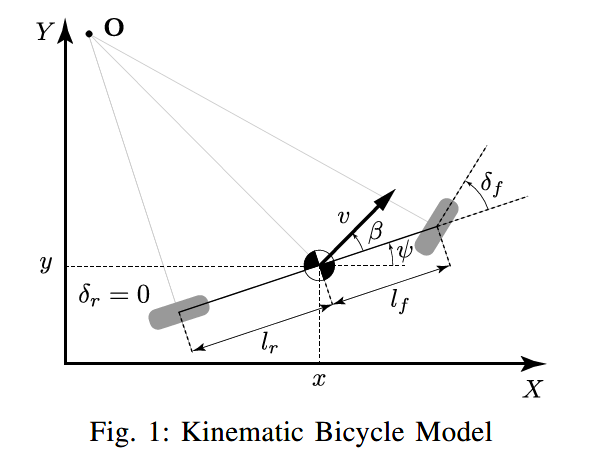

# Kinematic and Dynamic Vehicle Models for Autonomous Driving Control Design

`Jason Kong,Mark Pfeiffer,Georg Schildbach,Francesco Borrelli`
`2015 IEEE Intelligent Vehicles Symposium(IV)`

------

## Abstract

1. **kinematic and dynamic vehicle model**【该控制器设计的主要运动控制模型】
2. **the effect of discretization on forecast error**
3. **model predictive control (MPC) and a simple kinematic bicycle model**【实验硬件平台】
4. **less computationally expensive**【该控制器相较于vehicle tire models在曲线路段上的计算成本有优势，且在低速运行时后者存在的singular问题。vehicle tire models及singular问题参见参考文献7，8，10，11】

## Ⅰ. Introduction

> Tire models use a tire slip angle estimation term which has the vehicle velocity in the denominator. This prohibits the use of the same control design for stop-and-go scenarios, common in urban driving.

【找到问题症结，即应用动力学模型的MPC存在低速奇异、启停场景不适用的问题，故考虑引入计算成本更低且能有效改善上述问题的运动学模型】

## Ⅱ. Vehicle Models

### A. Kinematic Bicycle Model

$$
\Large
\begin{eqnarray*}
\dot x &=& v cos(\psi + \beta) \tag{1a}\\
\dot y &=& v sin(\psi + \beta) \tag{1b}\\
\dot \psi &=& \frac{v}{l_r}sin(\beta) \tag{1c}\\
\dot v &=& a \tag{1d}\\
\beta &=& tan^{-1}( \frac{l_r}{l_f+l_r}tan(\delta_f))\tag{1e}
\end{eqnarray*}
$$

> $\psi$ is the **inertial heading**
>
> Inputs:$\delta_f$ the front and rear steering angles($\delta_r=0$);$a$ acceleration

### B. Dynamic Bicycle Model

$$
\Large
\begin{eqnarray*}
\ddot x &=& \dot\psi\dot y+a_x \tag{2a}\\
\ddot y &=& -\dot\psi\dot x+\frac{2}{m}(F_{c,f}\cos\delta_f +F_{c,r}) \tag{2b}\\
\ddot\psi &=& \frac{2}{I_z}(l_fF_{c,f}-l_rF_{c,r}) \tag{2c}\\
\dot X &=& \dot x\cos\psi-\dot y\sin\psi \tag{2d}\\
\dot Y &=& \dot x\sin\psi+\dot y\cos\psi \tag{2e}
\end{eqnarray*}
$$

> $\dot x$ and $\dot y$ denote the longitudinal and lateral speeds in the body frame
>
> $F_{c,f}$ and $F_{c,r}$ denote the lateral tire forces at the front and rear wheels
>
> For the linear tire model, $F_{c,i}$ is defined as $\pmb{F_{c,i} = -C_{\alpha_i}\alpha_i}$, where $i\in\{f,r\}$,$\alpha_i$ is the tire slip angle and $C_{\alpha_i}$ is the tire cornering stiffness 

## Ⅲ. Comparison Between Dynamic and Kinematic Models

> Hyundai’s California Proving Grounds (**CPG**) in California City, California
>
> Input:a N-step measured input sequence 
>
> Model:kinematic or dynamtic
>
> **discretized** using Euler methods;**sampled** at $t_d =100ms$ or at $t_d=200ms$
>
> open-loop prediction error(measured state & simulated states)

### A. Test setup

> Hyundai Azera (total wheel-base of 2.843 m, $l_f =1.105 m\,and\,l_r = 1.738 m$)
>
> A GPS base station【RTK (real-time kinematic) integer precision (**σ = 0.02 m**) or  differential GPS precision(**σ = 0.4 m**)】
>
> An OTS (Oxford Technical Solutions) RT2002 sensing system(a differential GPS+an IMU +a DSP )【the precision of the measured heading angle **σ = 0.1 deg**】
>
> $v_{avg}=13.8m/s$ $v_{max}=17.1m/s$

### B.Model Comparion

> 
>
> 

### C. Discretization Efferts

> larger discretization times $\Longrightarrow$ predict a longer horizon
>
> shorter discretization times $\Longrightarrow$ more accurate predictions
>
> **longer discretization time $\Longrightarrow$ higher accuracy of the kinematic bicycle**
>
> 
>
> Since the **truncation errors** from a discretized kinematic model cause a wider turn

## Ⅳ. Model Predictive Controller

> 
>
> The controller and the path planner are run at every 100 ms
>
> **constrained finite-time optimal control problem**
> $$
> \Large
> \begin{eqnarray*}
> \bigcup^{min} &\,\,\,& \sum_{i=0}^{H_p}&(z_i-z_{ref,i})^TQ(z_i-z_{ref,i})+ \\
>  &\,&\sum_{i=0}^{H_p-1}&[(u_i-u_{i-1})^T\overline R(u_i-u_{i-1})+u_i^TRu_i]\\
> 
> \end{eqnarray*}
> $$

## Ⅴ. Controller Setup

> a dSpace MicroAutobox with an IBM PowerPC processor running at 900 MHz(The MPC controller, localization, and low level controllers)
>
> NPSOL(MPC formulation)
>
> 8 steps $\Longleftrightarrow$ looking ahead 1.6 s
>
> 

## Ⅵ. Results

> ### A. Low-Speed Tracking`a closed street`
>
> 
>
> Reference speed varies from 0 to 6 m/s
>
> Reference trajectory is a right turn 
>
> Stop and go situation
>
> Distance error relative from the reference path 
>
> > $\mu=0.03m$
> >
> > $\sigma=0.03m$
> >
> > $max=0.15m$
>
> ### B. Sinusoidal Path Following Results`CPG`
>
> $amplitude\, A=4m$ , $wavelength\, D=100m$ , $v_{x,1}=10m/s$ , $v_{x,2}=15m/s$
>
> along the longitudinal axis $v_{ref}=v_x\cdot\sqrt{1+(A\cdot\omega)^2\cdot \cos^2(\omega x）} $
>
> 
>
> $\mu_1=0.41m$ $\sigma_1=0.25m$ ; $\mu_2=1.08m$ $\sigma_2=0.68m$
>
> ### C. Winding Track Results`CPG`
>
> the human driven speed reference
>
> 
>
> 
>
> $error_{avg,0.7}=0.26m$ , $error_{avg,1}=0.58m$
>
> 
>
> When the **lateral acceleration** grows larger, it becomes more critical to use a model which takes into **consideration slip**, such as a **dynamic bicycle model**

## Ⅶ. Conclusion

1. 【基于对**kinematic bicycle model and dynamic bicycle model**两种模型的比较，设计出一种基于**MPC**框架的控制器】
2. 【实验结果表明：200ms离散的运动学模型便可达到100ms离散的动力学模型效果，且同为200ms离散的条件下，运动学模型的误差预测更为准确；相较于现有using **higher fidelity models**(the tire and road interaction)的MPC控制器，该控制器能够以更低的运算成本适应较宽的速度范围（含零速）】
3. 【适用于**stop-and-go** scenario；在曲线与正弦测试中能够以**低速**满足多种参考轨迹的跟踪精度要求，而在更**高速**的测试中，基于**a tire model**的控制器效果更佳】
4. 【展望：文中的**the kinematic bicycle model**结合适当的离散时间优化方法将对其预测精度的提升有帮助】