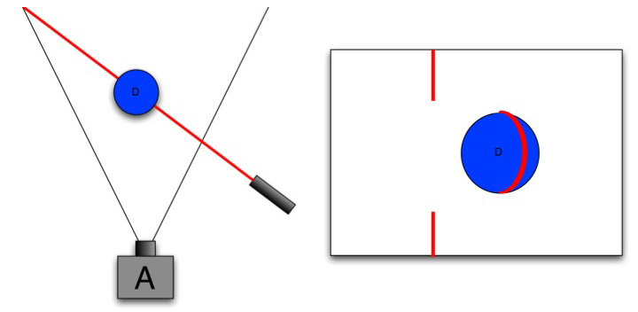

# 激光雷达（机械）

`Lidar` Light detection and ranging

计算激光束的反射时间和波长，以完整绘制障碍物的3D图像。机械式激光雷达将激光线束竖向排列形成一个面，通过机械旋转部件转动这个面，扫描周围环境即可呈现出三维立体图形

[经典的三角测距原理](https://www.jianshu.com/p/b12b4a4a64a3)

  
$$
\frac{f}{X}=\frac{q}{s}，即q=\frac{f \cdot s}{X}\\
$$

$$
\sin \beta = \frac{q}{d}，即d=\frac{q}{\sin \beta}\\
$$

$$
联立(1)(2)式，得d=\frac{f \cdot s}{X \cdot \sin \beta}
$$

唯一需要测量的便是X，而X可通过计算光斑的中心位置即可

## 从单点到激光器

将具备单点测距的激光器与成像器固定在一起，做成一个固定的装置，然后旋转即可获得周围的360°的扫描结果

  

## [Sick LMS511–10100 PRO SR](https://www.sick.com/cn/zh/detection-and-ranging-solutions/2d-lidar-/lms5xx/lms511-10100-pro/p/p215941)

  

- 光源：红外线（905nm）

- 激光类型：1（IEC 60825-1(2007-6)），对人眼无害

- 扫描范围：190°

    
 
    

- 扫描频率：25 Hz / 35 Hz / 50 Hz / 75 Hz / 100 Hz
- 角分辨率：0.167°，0.25°，0.333°，0.5°，0.667°，1°
- 工作范围：0m … 80m
- 10%反射率下的最大工作范围：40m
- 光点尺寸（×工作距离=实际光点大小）：11.9mrad
- 响应时间：≥10ms
- 系统误差
  - ± 25mm（1m … 10m）
  - ± 35mm（10m … 20m）
  - ± 50mm（20m … 30m）
- 统计误差
  - ± 6mm（1m … 10m）
  - ± 8mm（10m … 20m）
  - ± 14mm（20m … 30m）

# 摄像头

## 普通相机（被动三维测量）

- 单目视觉

- 双目视觉

  视差越大，与观测点的实际距离越近

    

## 结构光（主动三维测量）

激光投射器 + 光学衍射元件(DOE) + 红外摄像头

主动投射结构光到被测物体上

- 点结构光
- 线结构光
- 面结构光
- 光学图案编码（条纹投影技术等）

## ToF(Time of Flight)

传感器发出经调制的近红外光，遇到物体后反射，计算光线发射和反射的时间差或相位差

## 例: [Kinect](https://www.gamasutra.com/blogs/DanielLau/20131127/205820/The_Science_Behind_Kinects_or_Kinect_10_versus_20.php)

  

### Kinect 1.0

  

采用与激光雷达类似的三角测距原理（triangulation），搭载了`Light Coding`（以色列PrimeSense公司的Depth传感技术专利 US 2010/0118123 A1 ）方式的深度传感器，通过读取投射的红外线pattern形变程度获取深度信息

  

针对动态物体，使用近红外激光发射器产生伪随机点图以照亮整个视野范围，相机自带的图像处理硬件负责在投影点图中寻求相匹配的点图

 

投影中的点随着与观测点实际距离远近的变化而左右移动，所以只需跟踪对应点的水平坐标变化便可计算出其实际的深度信息变化

> Not having a constellation of points, there is no way for the Kinect processor to uniquely identify a dot in the projected pattern. We call this an *ambiguity*, and it means it cannot derive a depth estimate.

### Kinect 2.0

  

通过从投射的红外线脉冲反射回来的时间获取深度信息，相较于一代变更为`Time of Flight`（ 3DV Systems公司，Canesta公司 ，已被微软收购）方式的深度传感器

- 间接计算激光脉冲的飞行时间（ToF）实现测距
- 将传感器中的像素点一分为二，前半个像素处于开启状态时，接收外部反射的激光脉冲光子；处于关闭状态时，不再吸收光子。两者相位差为180°，保证“一开一闭”，而激光发生器保持与前半个像素的开闭状态同步

  

初始假设激光发射器与相机距离足够近，以忽略飞行时间；随着我们将激光发射器逐渐向远处移动，后半个像素接收的光子量越来越多，再经过几毫秒的曝光处理，便可以比较二者所记录的全部光子数量：由于后半个像素的光子量比前半个越来越多，就可以推断发射源与接收源间的距离在增加。

针对目标物表面会吸收一定的光子的问题，由于前后两个半像素收到光子数量折损的影响相同，所以只需计算各自的光子接收率而不是接收量即可解决

为尽量减少热噪声（例如漂浮在半导体晶格中的自由电子）对测量造成的影响，Kinect 2.0分两步进行测量

1. 低精度无歧义的深度估计
2. 在第一步的基础上进行更高精度的歧义性去除

####  [数据流的获取](https://www.cnblogs.com/TracePlus/p/4136321.html)

####   

`Reader`能够打开一个`Source`多次，适用于多线程应用同时调用同一传感器而无需拷贝数据

- Color数据

实际图像尺寸为1920 × 1080，只是在显示时采用`Opencv`中的`resize()`函数进行调整，以便于观察

  

Color数据的排列按照`RGRA`格式——蓝（B）绿（G）红（R）无效值（A）共计32bit构成1像素

- Depth数据

深度数据尺寸为512×424

 

Depth数据的排列，以16bit（0-4500）为1像素来构成，但由于`OpenCV`只能显示8bit（0-255 ）的图像数据，故使用`cv::Mat::convertTo()`指令将近距离的点显示得很白（255），远距离的显示得很黑（0）

一代的深度估计精度在1cm左右，能够以任意帧率运行

二代自带**内置的环境光抑制**，具备在太阳光下的工作能力，以至于开发者们认为其能够胜任汽车后视镜

### 配置对比

