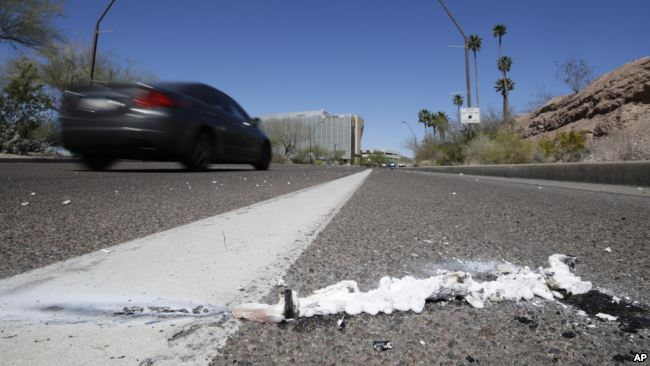
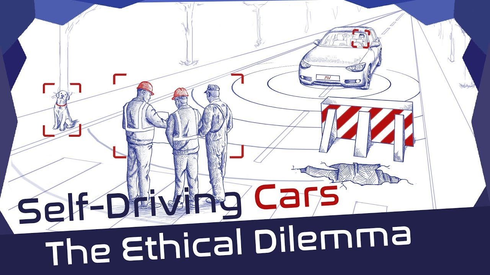

## 发展历程

- 1926年12月8号，第一篇关于自动驾驶系统（ADS）题为[*Phantom Auto Will Tour City*](<https://news.google.com/newspapers?id=unBQAAAAIBAJ&sjid=QQ8EAAAAIBAJ&pg=7304,3766749>)的文章刊登于The Milwaukee Sentinel
- 1977年，**日本筑波机械工程实验室**研发成功第一台自动驾驶汽车
- 1980s，卡内基梅隆大学的Navlab逐步确立了现代自动驾驶车辆的原型
- 1991年，美国政府投入6.5亿美元用于建设自动化高速公路系统
- 2015年，美国五个州和华盛顿特区批准自动驾驶汽车上路测试

- 2017年，Audi宣称其最新的A8系列在Audi AI的加持下能够实现时速60公里自动驾驶
- 2017年11月，Waymo声称已经开始无安全员下的无人驾驶测试
- 2018年12月，Waymo在美国实现自动驾驶出租车服务商业化

[*Where to? A History of Autonomous Vehicles*](<https://www.computerhistory.org/atchm/where-to-a-history-of-autonomous-vehicles/>)

## 法律定义[^1]

[^1]: 哥伦比亚特区地方法律规定

在公共道路行驶的自动驾驶车辆必须具备以下特性：

1. 任意时刻都能实现人工干预
2. 有能够满足人工驾驶需求的驾驶位
3.  能够根据当地的交通法规和机动车驾驶规范控制车辆行驶

一旦自动驾驶车辆发生交通事故，该由**车主**、**车企**抑或是**汽车自身**来承担法律责任？

## 人为因素干扰

- 自动驾驶系统需要预测行人、自行车以及动物的行动意图

- 行人与人类驾驶员也要能够预测自动驾驶车辆的行动意图

  [*Driveai*](<https://www.nbcnews.com/mach/science/what-s-big-orange-covered-leds-start-s-new-approach-ncna897151>)提出了一种通过加装状态指示灯告知人类车辆意图的解决方案

- 手动驾驶与自动驾驶状态间的切换问题

- 风险补偿

  自动驾驶车辆不同的伦理决策算法很有可能使骑自行车一项风险与时尚并存的“极限挑战运动”

## 优势

一旦无人驾驶技术成熟，由于人为原因造成的[交通事故](<https://en.wikipedia.org/wiki/Epidemiology_of_motor_vehicle_collisions>)数将大幅下降

降低导航与驾驶的人工成本

进一步提高限速标准，缓解交通压力

降低车辆保险费用

提高燃料利用率

节约停车空间（连续使用，省去停车空间）

## 事故伦理问题

[*Can you program ethics into a self-driving car?*](<https://ieeexplore.ieee.org/document/7473149>)

### 特斯拉

2015年10月中旬，特斯拉自动驾驶仪软件更新至version 7

2016年1月9日，推出version 7.1，增加了自动停车功能（Lv2，需驾驶员集中精力随时准备接管驾驶权，只能应用于高速公路，会时常出现无法识别车道标记并偏离车道的情况；而市内驾驶会出现无法识别信号路灯和行人的问题）

2016年1月20日，中国河北邯郸的特斯拉Model S司机（高雅宁，23岁）启动自动驾驶仪后直接[与一辆清扫车追尾](<https://qz.com/783009/the-scary-similarities-between-teslas-tsla-deadly-autopilot-crashes/>)。

2016年5月7日，美国佛罗里达州威利斯顿的一名Model S车主在车辆开启自动驾驶仪模式下与前方路口一辆正在左转的18轮拖车[发生追尾](<https://www.theguardian.com/technology/2016/jun/30/tesla-autopilot-death-self-driving-car-elon-musk>)，后根据美国国家公路交通安全管理局（NHTSA）事故认定，自动驾驶车辆并未及时采取刹车制动，且在冲撞后继续前进。

[Can Self-Driving Cars Be Engineered to Be Ethical?](<https://learningenglish.voanews.com/a/can-self-driving-cars-be-engineered-to-be-ethical/4308774.html>)

2018年3月18日， [Elaine Herzberg](https://en.wikipedia.org/wiki/Death_of_Elaine_Herzberg)成为了第一位因自动驾驶车辆冲撞身亡的行人，肇事车辆为一辆处于自动驾驶模式的Volvo SUV(Uber)

[Nicholas Evans](<https://www.uml.edu/profiles/nicholas-evans.aspx>)是马萨诸塞大学的一名哲学教授，主要负责为从事自动驾驶行业的工程师教授伦理学。他的学员中，有很多自动驾驶技术支持者坚信，目前有超过90%的道路交通事故都是由人为失误造成的，一旦能够将机器取代人类，事故率将大幅下降。

在面对不可避免的交通事故时，机器必须做出艰难的选择，而我们又愿意将多大的权力交由机器来处理。

2015年Waldrop在《Nature》发表的[报告](<https://www.nature.com/news/autonomous-vehicles-no-drivers-required-1.16832>)显示：如果事故不可避免，多数人不愿将选择权交由机器

一个非常基础且亟待解决的问题就是该如何衡量不同人的生命价值。尽管大多数人不愿提及这一问题，但这却是自动驾驶技术的关键问题

- 从驾驶员角度出发，车辆控制程序应以保护乘车人安全为第一要务
- 从行人等非机动车角度看，面对道路弱势群体，机动车又应主动避让

这不只是义务论与功利主义的冲突，还包含了人的自我保护以及自动驾驶汽车对车主的责任问题[^2]

[^2]: [The Ethics of Accident-Algorithms for Self-Driving Cars: an Applied Trolley Problem?](https://link.springer.com/article/10.1007%2Fs10677-016-9745-2)

法国图卢兹经济学院的Jean Francois Bonnefon等人于2016年在《Nature》上发表实证研究文章，调查研究表明：大部分公众不希望市场只提供单一“到的算法”的车型；在面对是牺牲自己还是牺牲他人的选择时，公众更倾向于拯救更多生命，但在选择购买何种算法的车型时，则绝对倾向于购买具有自我保护算法的车[^3]

[^3]: [The social dilemma of autonomous vehicles](<https://science.sciencemag.org/content/352/6293/1573>)

## 总结

目前自动驾驶伦理问题主要面临的还是交通事故中的**道德决策**，而其中**道德算法**该如何设定就显得尤为关键。

依我个人来看，如果能够在生命价值的精准量化上达成统一意见，则可套用现有传统决策算法/深度学习网络，或是在其基础上进行改进加以实现；但若无法量化标定，以目前的技术手段来说，计算机是无法处理连人类都无法评价结果好坏的任务的，只能转而寻求其他非数值计算的手段实现决策。