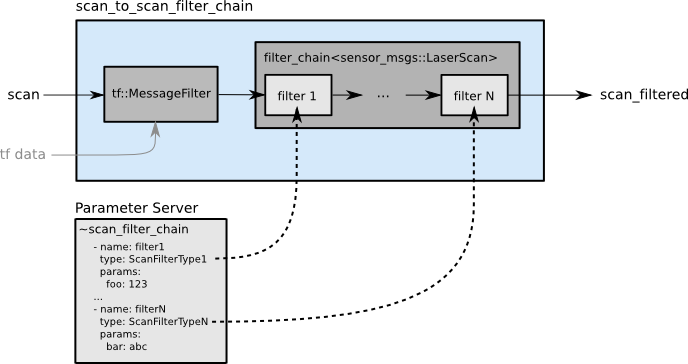
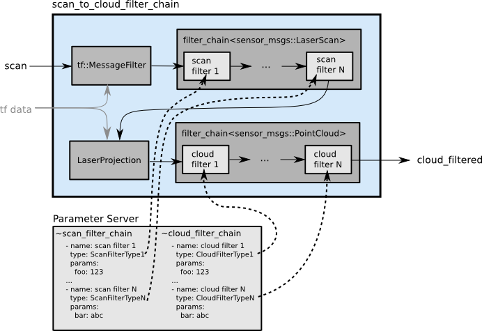

# Sick LMS511-20100

## [Windows下连接激光](https://blog.csdn.net/u013453604/article/details/50725833)

### Ethernet方式

- 电源线：24V直流电源
- 以太网线：与电脑网线端口直连，设置电脑IP与激光雷达IP（默认为192.168.12.140）同网段（此次安装选用192.168.12.10），手动设定子网掩码为255.255.255.0

1. 启动[SOPAS ET](https://www.sick.com/de/en/downloads/eula?code=swp367244)客户端软件后为激光雷达上电，初次运行会自动搜索到该设备
2. 双击右侧栏搜索到的设备即可添加到左侧项目栏，单击设备底部出现的**安装设备驱动程序**提示，选择**从设备上传**，等待十分钟左右即可自行安装完毕
3. 点击**离线**即可切换为**在线**模式
4. 双击在线的设备即可查看激光扫描的可视化结果

**帮助**——**SOPAS ET手册**可找到该软件的中文操作手册，进一步说明如何连接LMS系列设备


## [源码驱动安装](https://blog.csdn.net/zhuoyueljl/article/details/75244563)

```shell
$ mkdir -p ~/erobot_ws/src
$ cd  ~/erobot_ws/src
$ catkin_create_pkg laser_node std_msgs rospy roscpp
$ rm -rf laser_node/*
$ cd laser_node
$ git clone https://github.com/NatanBiesmans/lms5xx
```

> - 将源文件**src**中的**lms5xx_node.cpp**激光雷达IP（ip_add）改为自己的IP（192.168.12.140）

```shell
$ cd  ~/erobot_ws
$ catkin_make
$ source ~/erobot_ws/devel/setup.bash
```

### 测试

开启终端，执行

```shell
$ roscore
```

开启新终端，执行

```shell
$ rosrun laser_node laser_node
$ rostopic echo /scan
```

再开启新终端，执行

```shell
$ rosrun rviz rviz
```

`rviz`可视化界面下选择`Add`–> `by topic` –> `LaserScan`

此时会出现**status error**，再将`FixedFrame`修改为`laser`即可

> Sick官方[github](https://github.com/SICKAG/sick_scan)可下载此雷达的**.urdf**文件


## 调用激光雷达信息 `/scan`

### 消息定义`sensor_msgs/LaserScan.msg`

```cpp
std_msgs/Header header		
'''标准格式头信息，包括：unit32 seq顺序标示，time stamp时间戳，string frame_id参考坐标系id'''
float32 angle_min		'起始角度 [rad]'
float32 angle_max		'终止角度 [rad]'
float32 angle_increment	'角分辨率 [rad]'
float32 time_increment	'测量时间差 [seconds] 当激光雷达移动时用于插值'
float32 scan_time		'不同传感器间的时间差 [seconds]'
float32 range_min		'最小测量距离 [m]'
float32 range_max		'最大测量距离 [m]'
float32[] ranges		'测量数据 [m] 不在量程范围内的数据会被剔除'
float32[] intensities	'信号强度数据'
```

### [ROS Laser Pipeline Tutorials](http://wiki.ros.org/sensor_msgs/Tutorials)

#### 1. 如何使用激光雷达数据

查看激光雷达发布的话题

```shell
$ rostopic list -v | grep sensor_msgs/LaserScan
```

ROS定义下的点云信息 `sensor_msgs/PointCloud`

```cpp
Header header
geometry_msgs/Point32[] points	'Vector of 3d points (x,y,z)'
ChannelFloat32[] channels		'Space for extra information like color'
```

为了转化为点云信息，调用`laser_geometry`包内`laser_geometry::LaserProjector`类中的两个函数

- `projectLaser` 

  无需`tf`转换即可直接将 $(d,\alpha)$ 信息转化为 $(x,y,z)$，这也意味着生成的点云将以激光雷达为坐标原点，且当雷达在行进中进行扫描，所产生的数据会产生错乱；优点在于处理速度快

- `transformLaserScanToPointCloud` 

  绝大多数情况下都会选用这一函数进行变换

  使用`tf`转换将原始雷达数据变换至指定坐标系（最好为固定：若雷达位置固定选用`base_link`；当雷达移动时选择静态地图坐标系`map`），以便于自动插值

```cpp
#include "ros/ros.h"
#include "tf/transform_listener.h"
#include "sensor_msgs/PointCloud.h"
#include "tf/message_filter.h"
#include "message_filters/subscriber.h"
#include "laser_geometry/laser_geometry.h"

class LaserScanToPointCloud{

public:

  ros::NodeHandle n_;
  laser_geometry::LaserProjection projector_;
  tf::TransformListener listener_;
  message_filters::Subscriber<sensor_msgs::LaserScan> laser_sub_;
  tf::MessageFilter<sensor_msgs::LaserScan> laser_notifier_;
  ros::Publisher scan_pub_;

  LaserScanToPointCloud(ros::NodeHandle n) : 
    n_(n),
    laser_sub_(n_, "base_scan", 10),
    laser_notifier_(laser_sub_,listener_, "base_link", 10)
  {
    laser_notifier_.registerCallback(
      boost::bind(&LaserScanToPointCloud::scanCallback, this, _1));
    laser_notifier_.setTolerance(ros::Duration(0.01));
    scan_pub_ = n_.advertise<sensor_msgs::PointCloud>("/my_cloud",1);
  }

  void scanCallback (const sensor_msgs::LaserScan::ConstPtr& scan_in)
  {
    sensor_msgs::PointCloud cloud;
    try
    {
        projector_.transformLaserScanToPointCloud(
          "base_link",*scan_in, cloud,listener_);
        // base_link or map
    }
    catch (tf::TransformException& e)
    {
        std::cout << e.what();
        return;
    }
    
    // Do something with cloud.

    scan_pub_.publish(cloud);

  }
};

int main(int argc, char** argv)
{
  
  ros::init(argc, argv, "my_scan_to_cloud");
  ros::NodeHandle n;
  LaserScanToPointCloud lstopc(n);
  
  ros::spin();
  
  return 0;
}
```

#### [2. 使用激光滤波节点](http://wiki.ros.org/laser_filters#scan_to_scan_filter_chain)

`scan_to_scan_filter_chain`

  

`scan_to_cloud_filter_chain`

  

