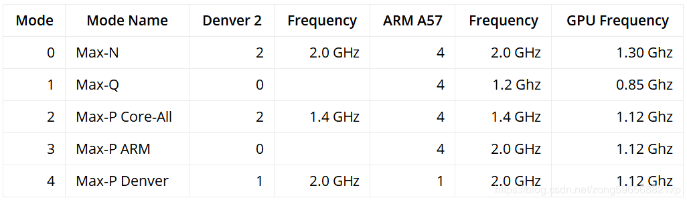

## 硬件

- 硬件温度监控

  ```shell
  cat /sys/devices/virtual/thermal/thermal_zone*/type	
  #显示硬件名称
  cat /sys/devices/virtual/thermal/thermal_zone*/temp	
  #对应硬件温度（除1000即为摄氏度）
  ```

### 风扇

- 开启默认强冷模式（模式1）

  ```
  sudo ./jetson_clocks.sh
  ```

  

- 查看当前风扇转速

  ```shell
  sudo watch -n 1 cat /sys/kernel/debug/tegra_fan/cur_pwm
  ```

- 查看当前工作模式

  ```shell
  sudo nvpmodel -q verbose
  ```

- 切换至模式0

  ```shell
  sudo nvpmodel -m 0
  ```

- 添加自定义模式

  参照原有实例修改添加于`/etc/nvpmodel.conf`文件

- 改变风扇转速

  目前实测有效的方法只有手动修改`./jetson_clocks.sh`文件中的变量`FAN_SPEED`的数值

  `/sys/kernel/debug/tegra_fan/target_pwm`文件只能修改为可读，无法修改


## 软件

[TX2入门教程软件篇](<https://www.ncnynl.com/category/TX2-software/>)

[Installing PyTorch on the NVIDIA Jetson TX1/TX2](<https://github.com/andrewadare/jetson-tx2-pytorch>)

[PyTorch for Jetson Nano](<https://devtalk.nvidia.com/default/topic/1049071/jetson-nano/pytorch-for-jetson-nano/>)

### CUDA

- 查看版本

  ```shell
  cat /usr/local/cuda/version.txt
  ```

  Version 9.0.252

### CUDNN

- 安装

  1. 在确认已经安装的CUDA版本后，到Nvidia官网`<https://developer.nvidia.com/rdp/cudnn-download>`下载对应版本的库文件（需要翻墙）

  2. 进入下载目录并解压

     ```shell
     cd /home/nvidia/Downloads
     sudo tar xvf cudnn-9.0-linux-x64-v7.6.0.64.tgz
     ```

  3. 复制头文件和动态链接库

     ```shell
     cd cuda
     sudo cp include/cudnn.h /usr/local/cuda/include/
     sudo cp lib64/* /usr/local/cuda/lib64/
     cd /usr/local/cuda/lib64/
     ls -a	#查看libcudnn版本，后续根据版本操作
     sudo chmod +r libcudnn.so.7.6.0
     ```

  4. 创建软连接

     ```shell
     sudo rm -rf libcudnn.so libcudnn.so.7
     sudo ln -s libcudnn.so.7.6.0 libcudnn.so.7
     sudo ln -s libcudnn.so.7 libcudnn.so
     sudo ldconfig
     ```

- 查看版本

  ```shell
  cat /usr/local/cuda/include/cudnn.h | grep CUDNN_MAJOR -A 2
  ```

  CUDDN_VERSION 7.6.0

### OpenCV

- 查看版本

  ```shell
  pkg-config --modversion opencv
  ```

  Version 3.4.3

### PyTorch

TX2是ARM架构，无法通过官方的方法`pip`或`conda`安装

#### 下载whl文件安装

[pytorch官方github](<https://github.com/pytorch/pytorch#from-source>)页面**Installation**有专栏**NVIDIA Jetson platforms**下载对应python版本的`.whl`文件

```shell
pip install torch-1.0.0a0+bb15580-cp27-cp27mu-linux_aarch64.whl
pip install torchvision
```

#### 自行编译（测试失败）

1. 系统性能拉满

   ```shell
   sudo nvpmodel -m 0
   sudo ~/jetson_clocks.sh
   ```

2. 下载官方PyTorch源文件

   ```shell
   git clone --recursive http://github.com/pytorch/pytorch
   cd pytorch
   ```

3. 设置编译参数

   ```shell
   export USE_NCCL=0
   export USE_DISTRIBUTED=0
   export TORCH_CUDA_ARCH_LIST="5.3;6.2;7.2"
   ```

   若使用新的终端，则需要重新导入

4. 编译

   - Python 2.7（**测试失败**）

     ```shell
     sudo apt-get install python-pip cmake
     pip install -U pip
     
     sudo pip install -U setuptools
     sudo pip install -r requirements.txt
     
     pip install scikit-build --user
     sudo apt-get install ninja-build
     
     python setup.py bdist_wheel
     ```

     `requirements.txt`包含六个包`future` `numpy` `pyyaml` `setuptools` `six` `typing`

   - Python 3.6（**测试失败**）

     ```shell
     sudo apt-get install python3-pip cmake
     
   sudo pip3 install -U setuptools
     sudo pip3 install -r requirements.txt
     
     pip3 install scikit-build --user
     pip3 install ninja --user
     
     python3 setup.py bdist_wheel
     ```
     
     

5. 验证

   ```python
   import torch
   print(torch.cuda.is_available())
   a = torch.cuda.FloatTensor(2)
   print(a)
   b = torch.randn(2).cuda()
   print(b)
   c = a + b
   print(c)
   ```

   理应输出

   ```python
   True
   
    0
    0
   [torch.cuda.FloatTensor of size 2 (GPU 0)]
   
    0.6851
   -0.3392
   [torch.cuda.FloatTensor of size 2 (GPU 0)]
   
    0.6851
   -0.3392
   [torch.cuda.FloatTensor of size 2 (GPU 0)]
   ```

   

