# 通过冗余驱动解决奇异性问题并扩展工作空间[^1]

[^1]:Gosselin 和 Schreiber - 2016 - Kinematically Redundant Spatial Parallel Mechanism.pdf

之所以对并联机构投入大量研究，一个重要的原因就是其连接上下平台的连杆只需承受简单的拉伸/压缩载荷，相较于承受弯曲应力的机构，其在材料选择上更具优势,[^1]承载能力也被大幅强化。但与此同时，并联机构也饱受奇异性问题与运动空间狭小的困扰。

## 奇异性分析[^2]

[^2]: <chapter 3-1 并联机构的奇异性.ppt>

处于奇异位形时，并联及结构自由度不能完全被约束，此时机构失去控制。

### 奇异性分类[^3，4]

[^3,4]:Gosselin 和 Angeles - 1990 - Singularity analysis of closed-loop kinematic chai.pdf  ,  Ma 和 Angeles - 1991 - Architecture singularities of platform manipulator.pdf

1. 模型奇异（公式奇异，通过**改变运动学模型**可避免）

   机构在特定位姿下的运动模型失效。

2. 构型奇异（最为严重，**必须避免**）

   机构的特定构型导致整个或部分工作空间失效。

   - 相似正六边形
   - 相似不规则多边形

3. 位形奇异（通过**轨迹规划**可避免）

   - Hunt奇异
   - Fichter奇异

### 解决方案

基于**区间分析**的计算方法，可保证规定有界区域内不存在奇点[^5]

[^5]:Hao 和 Merlet - 2005 - Multi-criteria optimal design of parallel manipula.pdf

## 工作空间分析[^6]

[^6]:<chapter 3-2 并联机构的工作空间分析TOstudents.ppt>

### 工作空间的分类

1. 位置空间（定姿态空间）

   给定平台姿态的条件下，参考点所能达到的所有位置。

2. 姿态空间

   给定参考点位置的条件下，平台所以能达到的所有姿态。

3. 灵巧空间

   平台能够以任何位姿到达的空间集合

4. 可达空间

   平台能够以至少一种路径达到的位姿集合

### 工作空间的限制因素

1. 支腿长度限制
2. 关节运动范围
3. 支腿干涉限制

一般而言，并联机构平台的最大倾角大约只能到45°，[^1]也就是说，“平移空间”（translational workspace）不再显得那么重要，因为只通过放缩机构整体尺寸即可实现。反而是“旋转空间”（rotational workspace）比较棘手。

### 解决方案

1. 在上下平台之间添加额外的$\rm H \underline{P} S$(**H**为虎克铰)支腿
   - 产生内部作用力/力矩，对相应的力/力矩控制算法提出更高的要求
   - 系统复杂度上升，制造与维护成本上升

2. 运动冗余（kinematic redundancy）

   在不增加内部抗力的前提下引入冗余结构。但目前这种方法都需要在支腿中串联安装额外的驱动装置，这种布置对于对结构刚度、响应速度和加速度都较为不利。

如果能够在支腿中并联安装额外的驱动装置，则即不影响系统性能，又进一步拓展了运动空间。[^1]

## 增加冗余支腿的并联机构

Merlet等借助格拉斯曼几何（Grassmann geometry）的方法，实现了通过六条与支腿相关联的Plücker lines对GS(Gough-Stewart)平台全部奇异点的控制。[^7]

[^7]:Merlet - Singular configurations of parallel manipulators an.pdf

在此基础上，提出一种运动学冗余支腿结构，既保留了GS平台的力传递特性，又避免了驱动冗余（也就规避了机构内部相互作用的问题）。两个移动副共同连接到上端的球副，而底端仍由各自两个虎克铰连接到基座。实际上，三个连接部件共面，且受限于底部虎克铰，无法传递垂直于该平面方向的力。通过重新定位平台上的力矢量子集，即有可能规避奇异点。[^1]

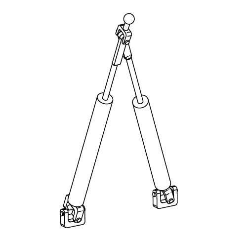

- $k$ 条冗余支腿，$(6-k)$ 条非冗余$\rm H \underline{P} S$支腿
- 自由度数 $=2k+(6-k)=(6+k)$

### 有效规避奇异点

#### 示例1：Hunt奇异（3d）

$3d$是“格拉斯曼变量”（Grassmann variety）的维数为$3$(called a plane)时三种（3d，3c，3b）中的一种，由三条直线$\cal F_1, F_2,F_3$组成的线集合，且三线共面。[^8]

[^8]:Merlet - 2006 - Parallel robots.pdf

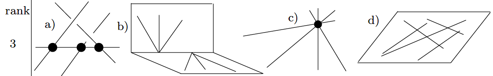

如下图所示，3，4，5，6支腿与上平台共面，若将6个支腿中的任意三个（要求冗余与非冗余交替分布）支腿使用上文所述的冗余支腿替换，则共面的四个支腿中将至少有一个(实际上是两个)为冗余支腿。

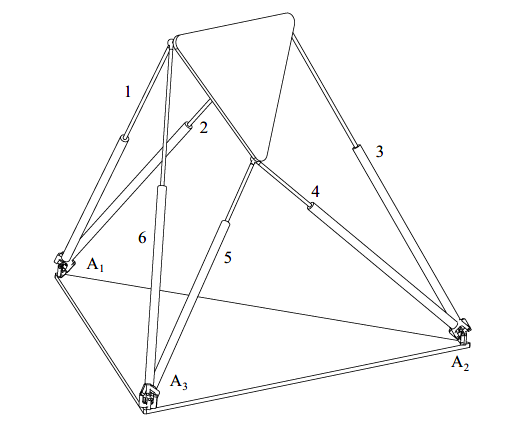

根据Gosselin等人提出的假设1[^1]，以只有一个冗余支腿的结构为例，冗余支腿$3_1和3_2$对应的两个底座连接点的连线穿过非冗余支腿$4$的底座连接点，但与其他非冗余支腿的底座连接点均未相交。因此，也就可以用冗余支腿来控制对应的$S_3B_3$支链（并不在3，4，5，6所在平面），从而避免了Hunt奇异。以此类推，只要两个冗余支腿不共用一个基座连接点，3，4，5，6中有两个冗余支腿的情况也将有效规避Hunt奇异。

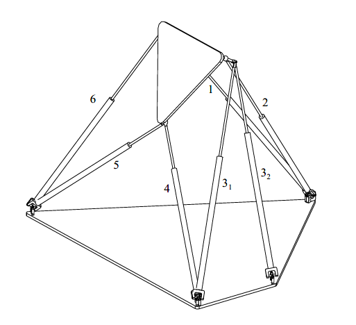

#### 示例2：Non-singular complex（5a）

当格拉斯曼变量$\cal C$达到$5$时，称之为*linear complex*, 是由在Plücker坐标系$(l, \overline{l} )$下的两个三维向量$(c,\overline{c})$组成的线集合。当满足$\overline{c}.c \neq 0$时即为$5a$。[^8]

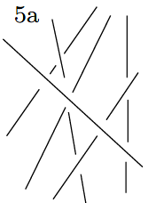

分别由支腿1-2，3-4，5-6确定的三条直线$D_1,D_2,D_3$共面并相交于一点。这种奇异状态可以通过将任意一个支腿更换为冗余支腿加以避免。

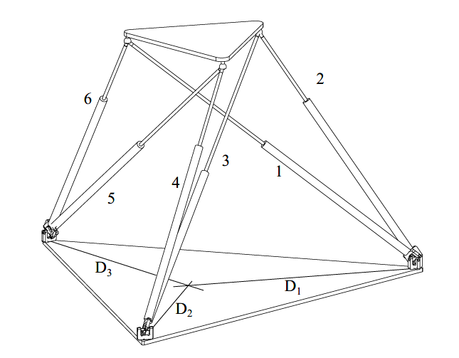

实际上，新组成的支链$S_5B_5$已经不再与直线$6$在基座平面内有交点。

> Finally, since the line passing through the base attachment points of the redundant leg does not intersect any of the other base attachment points, it is guaranteed that **no line of the new pencil** (if it exists) can be coplanar with the base plane. 
>
> Therefore, singularities corresponding to case 5a can always be avoided using
> the proposed architecture.

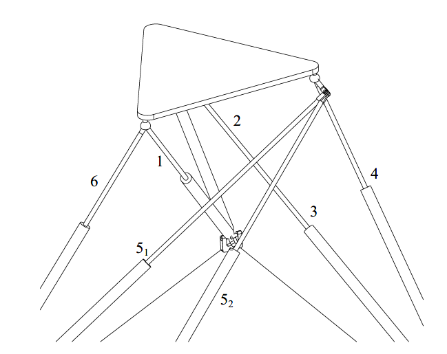

#### 示例3：Singular complex（5b）

与$5a$相似，当满足$\overline{c}.c = 0$时即为$5b$，即*complex*的所有直线都与Plücker坐标系下的线相交。[^8]

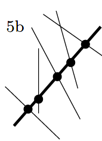

定义直线$D$为穿过支腿3-4和1-6的公共连接点的直线。也就是说，GS平台中的六条支腿所对应的直线均与公共直线$D$相交。此时由于支腿1，2，3共面，所以支腿2自然与$D$相交；

> Since the platform is **oriented** such that line $P$(defined along leg 5) also intersects line $D$, all $6$ legs intersect line $D$.

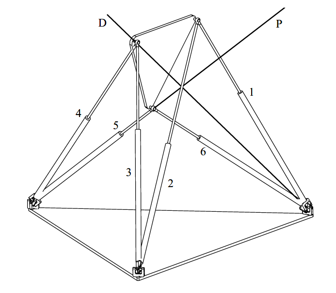

值得注意的是，由于直线$D$穿过了支腿3和4的公共连接点，将其中的任意支腿更换为冗余支腿均不能有效避免奇异。只有当直线$D$不在支腿1，2，5，6的运动平面内时，更换它们为冗余支腿才有可能避免奇异。而实际上，受限于假设1[^1]，只有支腿2，5适用，下图即以支腿2为例。因此，为了避免此种奇异状态，必须保证三条冗余支腿的基座连接点互不相邻，这就产生了两种布置方式，即1-3-5支腿冗余或2-4-6支腿冗余。

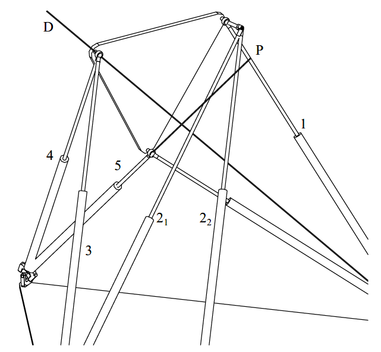

根据上述分析，在满足Gosselin提出的两条几何假设[^1]前提下，理论上来讲，带有三条冗余支腿的并联机构的运动平台能够克服奇异性而到达笛卡尔工作空间中的任一点。也就是说，限制工作空间的并不是机构的奇异性。

### 扩展工作空间

通过上文分析，发现并联机构的工作空间并不受限于奇异性，而取决于**主被动关节**和**机械干涉**。

#### Orientational workspace

上运动平台位置固定在工作空间的中心点（所有驱动器位于运动范围的中点附近），以$(\psi,\phi,\theta)$[^9]来描述运动空间。以指定参考点为起始点，以$\Delta \phi=1 ^\circ，\Delta \psi=1^\circ,\Delta \theta=1^\circ$为步长，完成整个扫描过程，实现对工作空间的刻画。由于不考虑被动关节与支腿间的机械干涉，故该结果可视为机构工作空间的上限。

[^9]:Advantages of the modified Euler angles in the design and control of PKMs

实验结果以柱坐标系$(z,r,\theta_c)$表示，其中$z$轴代表$\psi$，$r$轴代表$\theta$，$\theta_c$代表$\phi$。

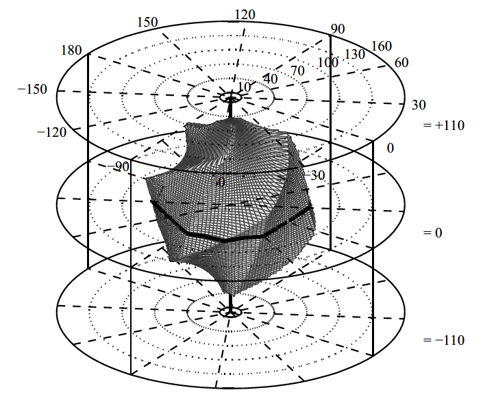

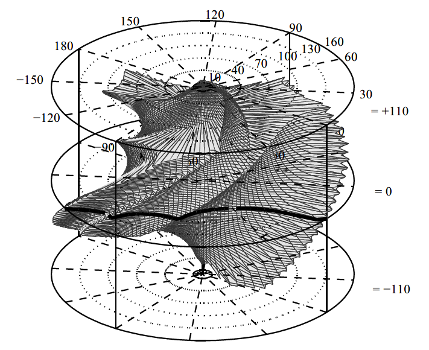

#### Translational workspace

根据实验对比结果发现，文中所采用的冗余支腿机构的工作空间在水平方向有所扩大，但在垂直方向也出现少许缩小。

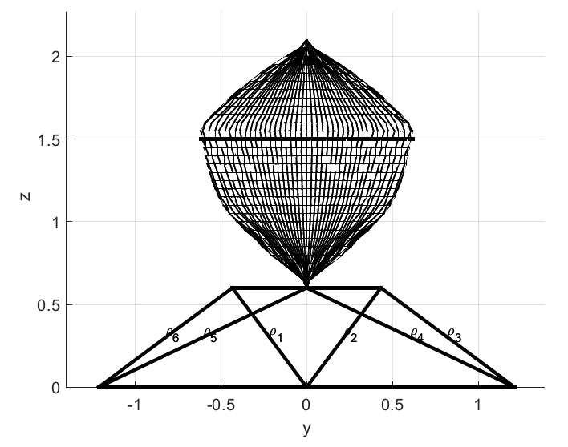

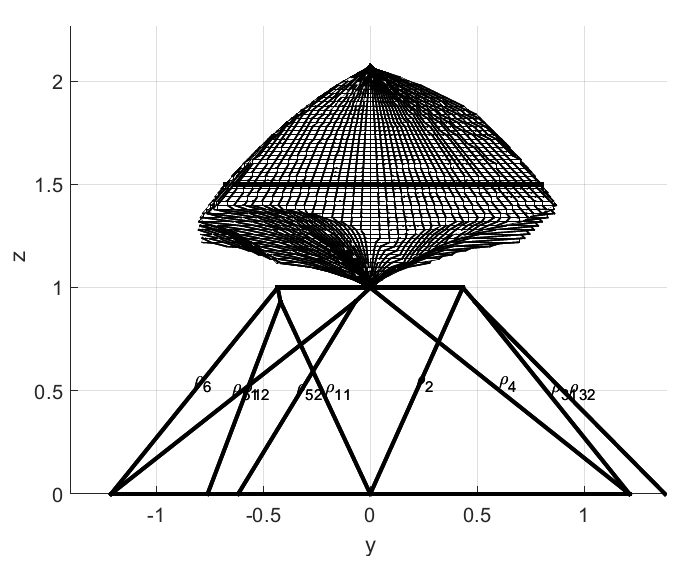

综上，相较于标准GS平台，文中提出的冗余支腿方案能够有效规避奇异性问题，并拓展工作空间。事实上，只要适当放大各支腿运动范围，由于不会受到奇异性的限制，将能够实现机构运动空间的进一步扩展。

