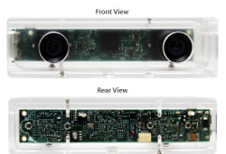

## 问题

`简明`

在计算资源受限的嵌入式硬件上实现基于视觉图像的实时三维目标检测

（嵌入式视觉：基于RGB图像的三维目标检测算法优化）

## 价值

`解决的问题有什么用处`

1. 为什么是“三维目标检测”？

   - 服务于自动驾驶技术

   - 自动驾驶技术的核心功能——实时环境感知[^1]

     [^1]: Multi-Task Multi-Sensor Fusion for 3D Object Detection

   - 为什么不是2D？

     虽然目前2D目标检测方法得到空前发展，各种网络算法不断更新迭代，但以自动驾驶的应用场景为例，传感器需要提供检测目标的类别以及包围框（Bounding Box）的长宽高、旋转角等更为全面的信息，以便后续转换为鸟瞰图（Bird’s Eye View）方便路径规划

     

2. 为什么要基于视觉图像（RGB/RGB-D）？

   - 成本

     激光雷达 > 双目相机 > 单目相机 

   - 准确率

     激光雷达 > 双目相机 > 单目相机

   目前领先的算法主要集中于

   - 激光
   - 激光与单目融合

   

   纯视觉做三维目标检测的方法在精确度上虽还不能与上述方法相提并论，但算法成长空间大，工业实用性强

   

3. 为什么是在嵌入式硬件上？

深度学习算法计算量巨大，通常需要运行在高性能的服务器上，对于前端运行提出了很高的要求

嵌入式GPU可发挥多核并发优势，并行运算

## 必要性

- 文献分析

  CVPR2015-2018收录论文术语共现图

​	ICCV2015-2017收录论文术语共现图

​	ICRA2015-2018收录论文术语共现图

​	IROS2015-2018收录论文术语共现图

针对基于视觉的目标检测一直是近来国际学术的研究热点，但根据各顶会收录论文的研究方向来看，关于三维目标检测方法的研究主要集中于图像分类、三维地图构建、包围框以及立体视觉等方面，而面向现有前沿检测算法的优化，或者说如何实现软硬件的结合这一问题还鲜有涉及。

对于已发表的仅采用彩色立体图像信息的“纯图像”检测方法，无论是算法本身的精确度还是对硬件算力的依赖性都尚有较大的提升空间，体现出本课题的价值

- 产品分析

  [Stereo vison camera pumps up images with Jetson TX2](<http://linuxgizmos.com/stereo-vision-camera-pumps-up-images-with-jetson-tx2/>) Sep 4, 2018

  相机OEM厂商**e–con Systems**于2018年9月推出一款搭载英伟达Jetson TX2的立体视觉相机TaraXL（一对OnSemi 1/3英寸 MT9V024型号的COMS视觉传感器）用以构建三维深度地图

  

  其开发的TaraXL SDK支持高精度深度地图模式，帧数可达25fps，支持USB3.0

  构建三维地图

  

  动态避障[Autonomous Vehicle powered with TaraXL Stereo Camera & NVIDIA TX2 | e-con Systems](<https://www.youtube.com/watch?v=UypJLwgsPxk&feature=youtu.be>)

  

根据目前OEM厂商对外放出的展示效果来看，搭载其TaraXL视觉系统的移动机器人能够实现室内静态环境的三维建图与简单的动态避障，相较于现有的众多激光或激光与视觉融合的室内导航方案，其“纯视觉”室内导航的成功案例对AGV领域具有重大意义。

然而，当面向自动驾驶领域时，复杂路况的动态物体识别对系统运算能力是极大的考验，上述产品显然还无法满足其要求。但其基于TX2的方案却启发我们：是否可以以尽量小的精度代价换取三维目标的快速检测？而针对这一设想，来自康纳尔大学的研究人员已经有最新的研究尝试，并发表于ICRA2019[《Anytime Stereo Image Depth Estimation on Mobile Devices》](<https://arxiv.org/abs/1810.11408>) 

文中提出名为AnyNet的网络结构，从原始图像中提取不同分辨率的特征图，优先根据低分辨率特征计算视差，进而获取深度信息，若时间允许则进一步提高分辨率，整个计算过程可以随时停止，而网络会返回一个当前所能达到的最优深度信息。以StereoNet为例，其在TX2上运行只能达到3fps，而[AnyNet](<https://mileyan.github.io/AnyNet/>)可以达到35fps的流畅运行，大大提高了车辆的紧急避障能力。

虽然只是实现了三维目标检测的第一步——深度估计，但也在一定程度上说明了这一研究方向可行性，倘若能够通过其他巧妙的优化手段，在AnyNet的基础上对生成的深度地图进行后续处理，最终实现在TX2上的高频率目标检测。

## 过程

`收集方法/处理过程/结果分析`

#### 深度学习针对嵌入式的优化方法

- 算法软件优化

  - 网络结构优化

  - 模型压缩剪枝

  - 定点化，二值化

  - 单指令多数据（SIMD），多线程

    一次一条指令做多个操作，增加缓存命中，减少内存访问

  - 异构计算

    根据所选硬件不同，定制化的指令不同

- 硬件选择

  - ASIC专用芯片

    谷歌TPU，中科院DIANNAO系列

    上述芯片需找到大量使用的客户方可降低成本

  - 基于GPU的方案

    英伟达Jetson TX1, Jetson TX2等嵌入式GPU方案

    发挥GPU多核并发优势，进行并行运算，实现几倍的加速效果

  - 基于FPGA的方案

    赛灵思FPGA

    对开发者能力要求高，既要熟悉软件，又要熟悉硬件，目前已有一些公司能够将成熟的深度学习模型直接导入自己的FPGA方案中，但对于内部优化知之甚少，且整个方案的成本非常高

  - 基于DSP的方案

    DSP，高通，Movidius，CEVA等厂商

    成本低，可进行数字信号处理，对于图像有专门的并行操作以进行快速访问与计算
    
  - 纯CPU方案
  
    ARM，MIPS等
  
    只要将算法面向CPU进行优化，在上述芯片上就会得到进一步的速度提升
  
- 总结

  - 硬件成本

    GPU与FPGA面向高端领域，成本与功耗更高，计算能力更为突出

  - 优化难度

    纯CPU的方式对算法优化提出了非常高的要求

#### 处理过程与分析

1. 将AnyNet与现有高性能网络（输入深度地图，输出三维预测边界框）进行拼接整合，初步验证AnyNet是否有效提升运算效率
2. 将AnyNet得到的深度信息进行表达方式上的转换，生成“伪雷达”信息，后续与现有高性能网络（基于激光雷达的检测算法）拼接，验证“伪雷达”的表示方法是否对检测精度有所提高[^2]

[^2]:Pseudo-LiDAR from Visual Depth Estimation: Bridging the Gap in 3D Object Detection for Autonomous Driving

3. 根据上述两组实验结果，对计算精度与实时性进行取舍，优化网络结构，最终得到指定帧数下检测精度最高的网络框架

## 缺点与不足

#### 纯三维视觉目标检测的难点

- 遮挡：目标物体相互遮挡/目标物体被背景遮挡
- 截断：被检测物体被图片截断
- 小目标：目标物体所占用的像素点过少
- 旋转角度学习：不同朝向的相同物体，特征区别小，难以学习
- 缺失深度信息：图像信息稠密、成本低，但缺失深度信息

