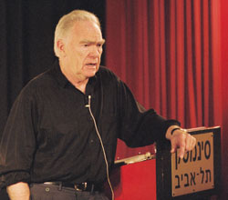
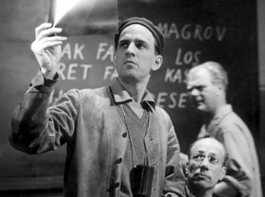

# 故事：材质、结构、风格和银幕剧作的原理

[罗伯特·麦基（Robert McKee，1941年－）](https://zh.wikipedia.org/wiki/%E7%BD%97%E4%BC%AF%E7%89%B9%C2%B7%E9%BA%A6%E5%9F%BA)

## 序言

> 《故事》论述的是原理，而不是规则
>
> 规则说：“你必须以这种方式做。”原理说：“这种方式有效······而且经过了时间的验证”
>
> 急于求成、缺少经验的作家往往遵从规则；离经叛道、非科班的作家破除规则；艺术家则精通形式

> **帕斯卡尔**曾经给朋友写过一封长而无当的书信，然后在信尾[又及](https://zh.wiktionary.org/zh-hans/%E5%8F%88%E5%8F%8A)中深表歉意，说他没时间写一封短信

【啰嗦的流水账总是信手拈来的，字斟句酌后“力图以最少的文字表达最多的信息”才费时耗力】

## PARTⅠ 作家和故事艺术

### CHAPTER01 故事问题

#### 故事与生活

> **“个人故事”**结构性欠缺，只是对生活片段的呆板刻画，错误地将**表象逼真**当成**生活真实**
>
> **“保证商业成功”**的剧本却是一种结构性过强、复杂化过度、人物设置过多的感官刺激，全然割断了与生活的任何联系

【故事来源于生活，但不是机械地照搬】

## PARTⅡ 故事诸要素

### CHAPTER02 结构图谱

#### 故事三角

> 我们必须想方设法引导观众从**外在的行为**来解析角色的**内在生活**，而不能利用画外解说或人物的自我告白
>
> 电影就是将精神的东西物化。——约翰·卡彭特

> 经典设计
>
> > - 大情节
> > - 小情节（最小主义）
> > - 反情节

#### 故事三角内的形式差异

> - 闭合式结局 $vs$ 开放式结局
> - 外在冲突 $vs$ 内在冲突
> - 单一主人公 $vs$ 多重主人公
> - 主动主人公 $vs$ 被动主人公
> - 线性时间 $vs$ 非线性时间
> - 因果 $vs$ 巧合
> - 连贯现实 $vs$ 非连贯现实
> - 变化 $vs$ 静止

#### 故事设计的政治学

> 随着故事设计从大情节开始向下滑行到三角底边的小情节、反情节和非情节时，观众的数目将会不断缩减

【当作者自认为独辟蹊径、不走寻常路时，其受众规模也将大打折扣，这也可能是众多叫好不叫座的优秀作品的尴尬之处】

> 无论其背景或教育程度如何，每一个人都是自觉或本能地带着**经典的预期**进入故事仪式的

【经典的大情节故事模式是每一位作家的必修课，尝试创作反情节与小情节故事的前提是对大情节的精通】

> [花衣魔笛手（Pied Piper）](https://en.wikipedia.org/wiki/Pied_Piper_of_Hamelin)：又称“哈梅林的花衣魔笛手”，典出德国民间传说

> 对父权的愤怒反抗并不是创造力，而是为了博取关注的忤逆行为。为不同而不同就像对商业法则盲从一样空洞。你只能写你自己的东西

【以好莱坞作为比对，为了不与商业片“同流合污”而处处反其道而行之，“因为它不是什么”而违心地写作只是在“拿文学撒气”】

### CHAPTER03 结构与背景

#### 向陈词滥调宣战

> 作者不了解他故事中的世界

【仅凭单单一个故事背景就开始落笔写作，就会陷入剽窃具有相似背景故事的场景、对白、人物的泥潭】

#### 创作限制原理

> 一切优秀的故事都发生在一个有限的、可知的世界内。一个虚构的世界无论看上去多么宏伟，只要仔细观察，你便能发现它是那样异常的狭小

#### 调查研究

> - 记忆研究
>
> > 探索你的过去，让情景再现，然后把它写下来
>
> - 想象研究
>
> > 那些看上去毫无联系、支离破碎的梦境和体验之间的隐藏关联将被想象搜寻出来，并融合为一个整体
>
> - 事实研究
>
> > 无论你多么有才华，无知的人是写不出东西来的

### CHAPTER04 结构与类型

#### 电影类型

> - 爱情故事
>
> > 哥们救赎
>
> - 恐怖片
>
> > 离奇恐怖（尚可“理性”解释）
> >
> > 超自然恐怖（“非理性”现象）
> >
> > 超级离奇恐怖（上述二者之间）
>
> - 现代史诗（个人对抗国家）
>
> - 西部片
>
> > [《Six Guns and Society: A Structural Study of the Western》](https://www.ucpress.edu/book/9780520034914/sixguns-and-society)
>
> - 战争类型
>
> > 拥战
> >
> > 反战
>
> - 成熟情节/成长故事
> - 救赎情节
> - 惩罚情节
> - 考验情节
> - 教育情节
> - 幻灭情节
> - 喜剧
>
> > 恶搞、讽刺、情景、浪漫、荒诞、闹剧、黑色
> >
> > （其差异表现在喜剧攻击的焦点和嘲讽的程度）
>
> - 犯罪
>
> > 以不同的视点分类
> >
> > - 神秘谋杀（侦探）
> > - 罪行（罪犯）
> > - 侦探（警察）
> > - 黑帮（匪徒）
> > - 惊悚或复仇故事（受害者）
> > - 法庭（律师）
> > - 报纸（记者）
> > - 谍战（间谍）
> > - 监狱戏（囚犯）
> > - 黑色电影（兼罪犯、侦探和荡妇受害者为一身）
>
> - 社会剧
>
> > 家庭剧、女性电影、政治剧、生态剧、医药剧、精神分析剧
>
> - 动作/探险
>
> > 高端探险、灾难/生存
>
> - 历史剧
> - 传记
>
> > 自传
>
> - 纪实剧
> - 嘲讽纪录片
> - 音乐片
> - 科学幻想
> - 体育类型
> - 幻想
> - 动画
> - 艺术电影
>
> > 最小主义
> >
> > 反结构

#### 持之以恒的天赋

> 银幕剧作并不是短跑，而是长跑
>
> 什么东西足以使你的欲望一刻不停的燃烧长达数月的时间？
>
> 真心实意地选择好你的**类型**，因为在想要写作的所有原因中，唯一能时时刻刻为我们提供养分的，就是**对作品本身的爱**

### CHAPTER05 结构与人物

#### 人物$vs$人物塑造

> **人物性格真相（True Character）**在人处于压力之下做出选择时得到揭示——压力越大，揭示越深，其选择便越真实地体现了人物的本性
>
> **苏菲的选择（Sophie’s Choice）：**美国作家威廉·斯泰伦于1979年出版的小说，泛指两害必取其一的悲剧性选择

#### 人物性格揭示

> 小角色也许无所谓隐藏的维度，但主要人物必须得到深刻的描写——他们的内心绝不能和他们的外表一摸一样

#### 结构和人物的功能

> 关键是要**适度**
>
> 人物的相对复杂性必须与类型相互适应

【也就没有必要对动作/喜剧类故事中的人物深度做过高要求，对这类故事来说，拔高深度将极易分散观众的注意力】

#### 高潮与人物

> **首开（Opening）**：一部影片公开放映的开始。缘起当年电影圈内流行的一个老说法：“电影就像降落伞——如果打不开，就得死。”
>
> 所有**时间艺术**的第一大训诫就是：“汝必留最佳于最后（Thou shalt save the best for last）”。【仿《圣经》“十诫”句式】

### CHAPTER06 结构与意义

#### 前提

> `如果······将会发生什么？`

#### 作为修辞的结构

> 对作者主观思想的解释，无论通过对白还是画外解说，都会严重降低一部影片的质量

#### 主控思想

> 真正的主题并不是一个词，而是一个句子——一个能够表达故事不可磨灭意义的明白而连贯的句子

【“贫穷”、“战争”、“和平”、“爱情”等等，这些都只是背景或类型，并不是所有爱情故事都在表达相同的情感】

> 主控思想具有两个组成部分：**价值**加**原因**

> [帕迪·查耶夫斯基](https://zh.wikipedia.org/wiki/%E5%B8%95%E8%BF%AA%C2%B7%E6%9F%A5%E8%80%B6%E5%A4%AB%E6%96%AF%E5%9F%BA)（英语：**Sidney Aaron "Paddy" Chayefsky**，1923年1月29日－1981年8月1日）美国戏剧作家、银幕剧作家和小说家，是史上唯一一个单独三次获奥斯卡最佳编剧的人

#### 说教倾向

> 说教根源于一种天真的热情，认为虚构作品就像手术刀一样可以用来切除社会的毒瘤
>
> 有史以来，所有经典作品给予我们的并不是解决办法，而是一剂令我们保持清醒的良药

> 在创造故事“论战”的维度时，必须万分小心谨慎地给予交战双方**同样的火力**

#### 理想主义者、悲观主义者和反讽主义者

> 在高潮处三种可能的情感负荷中，反讽是最最难写的，它需要最深的智慧和最高的手艺
>
> 1. 反讽高潮是一个单一的动作，必须同时表达一个正面和负面的陈述
> 2. 如何才能**明确地**说清二者？
> 3. 我们该如何表达，才能使对立的价值负荷在观众的体验中两不相犯，以免互相抵消

## PARTⅢ 故事设计原理

### CHAPTER07 故事材质

#### 鸿沟内的创造

> 作者必须不断地转换视点。他进入一个人物的意识中心，并提出这样的问题：
>
> “如果我是这个人物，在这种情况下，我会怎么办？”
>
> 他在自己的情感范围内感觉到一个具体的人类反应并想象人物的下一步动作。

【在**期望**与**结果**之间创造裂缝】

> 任何故事中的许多动作都或多或少在预料之中
>
> 优秀的写作不太强调发生了什么，而是强调**发生于谁**、**为什么发生**以及**如何发生**
>
> 最丰富、最满足的愉悦来自那些聚焦于**事件导致的反应与所获所见的故事**
>
> 任何场景中，如果反应缺乏见地和想象，迫使期望等同于结果，那么这个场景便是一个“毫无意义的**节奏杀手**”

【故事的经典框架都已成熟，优秀作品大多在其中的具体情节上做文章，即着重推敲不同**人物间的交互**，以一个又一个**出其不意**的矛盾与冲突冲击着观众的感官，构成不同**故事节拍**。相反的，当过多着墨于必定会发生的闲杂事，将冲淡主线剧情】

### CHAPTER08 激励事件

> 故事是一个由五部分组成的设计：**激励事件、进展纠葛、危机、高潮、结局**

#### 故事的世界

> 问题清单
>
> - 我的人物靠什么为生？——只聚焦于问题难以解决的时刻
> - 我的世界的政治是什么？——权力
> - 我的世界的仪式是什么？
> - 我的世界的价值观是什么？
> - 类型或类型组合是什么？
> - 我的人物履历是什么？
> - 幕后故事是什么？——用以推进故事进展的一整套发生在人物过去的重大事件
> - 我的角色设计是什么？——对同一事件没有两个人物会做出同样的反应/人物反应独立

#### 作者资格

> 控制观众感情投入的两条原理：
>
> 1. 移情：对主人公的认同
> 2. 可信：我们必须心甘情愿地暂停我们的不信任（塞缪尔·泰勒·柯勒律治）
>
> 可信性与所谓的现实毫无关系
>
> 真实可信取决于少量精选的细节

【故事的可信性是观众产生移情的前提】

#### 激励事件

> 激励事件必须**彻底打破**主人公生活中各种力量的**平衡**
>
> 激励事件偶尔需要由两个事件来构成：一个**伏笔**，一个**分晓**

【设置“激励事件”目的便在于引出主人公的一系列行动，推动情节发展，因而那些对主人公生活平衡没有重大影响的情节也就失去存在的必要】

> **主情节的激励事件必须发生在银幕之上**——不能发生在幕后故事中
>
> 自我解释的对白不能说服任何人

【故事不是论文，越解释越失去了故事的味道，最终连可信性都成了问题】

#### 激励事件的定位

> 应该把主情节的激励事件尽快引入······但务必等到**时机成熟**
>
> 如果说我们作家在激励事件的设计和定位上有什么通病的话，那就是，我们会**习惯上地推迟主情节**

【过早会令人困惑，过晚会令人厌倦】

#### 激励时间的创造

> 我们之所以总是在**“最好”**和**“最坏”**之间伸展，是因为故事若要成为艺术，并不是讲述人类体验的**中间地带**

【是不是可以将“中间地带”理解为前文提及的主人公原有生活的平衡点，故事情节的推进过程就应该像跷跷板般起起伏伏，在震荡中迎来最终的高潮，以获得人物关系的新秩序结尾】

### CHAPTER09 幕设计

#### 进展纠葛

> 一般而言，一部**故事片长度**的**大剧情**影片都是设计为**四十到六十个场景**，组合成**十二到十八个序列**，构建为**三个或更多的幕**，其力度一个强似一个，循序渐进，直到路线终点

> 如果说历史给我们提供了什么教训的话，那就是，当毒化人心的梦魇终于被清除，当无家可归者能安居乐业，当全世界完全采用太阳能时，我们每一个人的烦恼都还会是那样深重且铺天盖地

【生活本身便充斥着各种冲突，一厢情愿地回避矛盾，描绘出只会是一个理想化的梦境，而不是故事】

> **纠葛：只发生于一个层面的冲突**
>
> 内心冲突——意识流
>
> 个人冲突——肥皂剧
>
> 个人外在冲突——动作/探险、闹剧
>
> **复杂型：发生在所有三个层面的冲突**

#### 幕设计

> 故事艺术的基础：**三幕故事节奏**
>
> 作家必须小心翼翼地趟过这一长长的第二幕泥沼。对此，有两种可能的解决办法：**增加次情节**或**增加新的幕**
>
> 设计5-7幕存在的问题：
>
> 1. 幕高潮的繁殖容易招致陈词滥调
> 2. 幕的繁殖会削弱高潮的冲击力并导致重复感（如果每一个场景都想做到振聋发聩，那么我们真的会变成聋子）

#### 幕节奏

> 你不能用上扬结局来铺设上扬结局；你不能用低落结局来铺设低落结局

【寻求故事设定中正负价值的交替变换】

> 尽管我们知道最后一幕和倒数第二幕高潮必须相互矛盾，我们却无从预测故事的其他各幕高潮的价值是正面还是负面

【正如**鸿沟中的创造**中所言，经典的三幕体系已经能够满足大多数故事框架的构建，但在第一幕到倒数第二幕的高潮前的创作空间确实无限的，不同的作者将在这一领域为自己的作品刻上专属于自己的艺术风格和故事节奏】

### CHAPTER10 场景设计

#### 转折点

> 转折点的效果是四重的：**惊奇**、**增加好奇**、**见识**和**新方向**
>
> 讲故事的人把我们引入期望之中，让我们以为自己一切都明白，然后将现实撕裂，制造惊奇和好奇，把我们一次又一次往故事的前面部分送
>
> 一个漂亮的转折时刻起到的效果是，当观众突然获得了某种见解时，**看起来就好像是他们自己做到了这一点**

【所谓的“伏笔”都在为“转折点”而服务，而转折点的设计又要足够轻松自然】

#### 伏笔和分晓

> 当我们收集齐讽刺好莱坞虚伪的所有场景时，我们意识到，号称是**教育社会**如何解决其缺点的商业电影肯定都是**虚伪的**。因为，除了极少数特例之外，大多数电影制作者，就像**苏利文**（*Sullivan's Travels*，1941，美国喜剧）一样，只对电影中的穷人感兴趣，对实际生活中受苦受难的穷人却不闻不问

【这只是文中引用伏笔与分晓设计的一个分析实例，但该电影剧本所反映的现实问题也十分引人注目】

> 伏笔必须埋值得**足够牢固**，当观众的记忆急速回溯时，他们还能找出那些伏笔

【伏笔的刻画要轻重得当，太轻难以留下印象，太重又会让敏感的观众老早便知晓后续的转折。注意取舍，显而易见的转折便不再需要为其用过多的笔墨留伏笔】

> **推理**是第二位的，属于后创作范畴。**想象**是高于其他一切的第一位的先决条件

#### 情感转变

> 回报递减定理：我们对某事的体验越多，它所产生的效果就会越少
>
> 事实上，“严肃”感情的重复是一种行家惯用的喜剧手法

【虽然看上去喜剧可以令观众连续经历放声大笑，有悖于回报递减定理，但实际上笑不是情感，欢乐才是。本质上来讲，笑话大师绝不会一个包袱接一个包袱地抖下去】

#### 选择的性质

> **善恶**或**是非**之间的选择根本不是什么选择
>
> 人类的本性决定了，我们每一个人**永远会选择“善”或“是”**，只要我们能够感知到“善”或“是”

【所以在人物选择的设计上要避免对善恶是非的选择，因为观众早已明白人物选择的原则，也将提前知道人物如何选择（人物自身视角的“善”或“是”）】

> 真正的选择是**两难之择**。它发生于两种情景：
>
> 1. 不可调和的**两善取其一**的选择
> 2. **两恶取其轻**的选择

### CHAPTER11 场景分析

#### 文本和潜文本

> 我们意识到，自己不可能说出和做出我们真正所想和所感的东西。如果我们都那样做的话，生活就会变成一所疯人院
>
> 无论我们多么希望昭示我们最深层的感受，但它们总是在规避着我们。我们永远不可能完全表达出自己的真情实感。因为我们很少真正了解它们

【**任何文本都有其潜文本**无论作者是否为自己笔下的场景设计有潜文本，无论是银幕后的演员还是银幕前的观众都会自行加上其所理解的潜文本，所以没有潜文本的场景不仅会出现情感传达不到位的问题，甚至会被曲解演绎】

#### 场景分析技巧

> 1. 确定冲突（谁？为了什么？谁又在阻拦？为了什么而阻拦？）
> 2. 标注开篇价值（正面/负面）
> 3. 将场景分解为节拍（人物行为中动作/反应的一种交流，出现重复交流视为同一节拍）
> 4. 标注结尾价值并比较开篇价值（平淡乏味/发生转折）
> 5. 审察节拍并定位转折点

### CHAPTER12 布局谋篇

#### 进度

>我们引导观众像一个**长跑运动员**一样运动，**不是以匀速奔跑**，而是时而加速，时而减速，然后再加速，创造出一个周期，允许他达到其潜能的极限

【所谓“一张一弛，张弛有度”，连续的神经紧绷会令观众迅速进入疲态】

#### 反讽升华

> 反讽故事模式：
>
> 1. 他终于得到了他一直想要的东西······但是已经太晚了，他不可能拥有它
> 2. 他被推到离他的目标越来越远的地方······结果却发现事实上他已被引导到他的目标
> 3. 他抛弃了他事后才发现的对他的幸福不可缺少的东西
> 4. 为了达到某一目标，他不知不觉地采取了一些背道而驰的步骤
> 5. 他采取行动想要毁灭某一事物，结果却适得其反，搬起石头砸了自己的脚
> 6. 他得到了某种他坚信会给他带来厄运的东西，想方设法要摆脱它······结果却发现那是一份幸福的厚礼

#### 过渡原理

> 第三要素是用于过渡的铰链；是两个场景中**共有的**东西或两个场景中**互成反对的**东西

【两个不连续的场景间需要第三要素的润滑】

### CHAPTER13 危机、高潮和结局

#### 高潮中的危机

>所有故事结局的关键就是给予观众他们想要的东西，但不是通过他们所期望的方式（**William Goldman**威廉·戈德曼）
>
>一个结局必须同时是“不可避免而又出乎意料”的（*Aristotélēs*亚里士多德）
>
>观众所需要的是情感的满足——一个满足预期的高潮

【“不可避免”——种种线索与铺垫的情节使观众认为，当前的讲述路径是唯一的；“出乎意料”——以一种不可预期的方式发生】

## PARTⅣ 作家在工作

> 任何文章的初稿都是狗屎（**Ernest Miller Hemingway**欧内斯特·米勒·海明威）

【这就是所谓“文章都是改出来的”】

### CHAPTER14 反面人物塑造原理

> 反面人物塑造原理：主人公及其故事的智慧魅力和情感魄力，必须与对抗力量相适应
>
> 反对主人公的对抗力量越强大越复杂、人物和故事必定会发展得越充分

【重启的《超人》系列就存在主角力量体系过于强悍、反派存在感低的问题，导致高潮部分的节奏与紧张感始终提不上去】

#### 将故事和人物带到线索的终点

> 在英语中，双重否定不符合语法规则，但意大利语却可采用双重甚至三重否定来表达一个否定陈述，以使其形意相符

> 优秀作家一直明白，相反价值并不是人生体验的极限
>
> 一个简单讲述爱情/仇恨、真理/谎言、自由/奴役、勇气/怯懦之类的故事必定会流于琐屑
>
> 如果一个故事没有达到负面之负面，它也许会给观众带来一种满足感，但绝不可能辉煌，更无从变得高尚

### CHAPTER15 解说

#### 展示，不告诉

> 没有人会去告诉另一人他们两个都已经知道的事情，除非阐述明显的事实是为了填补另一个迫切的需要

【当两人重复谈及彼此知晓的内容时，谈话会失去目的性，这段描写也就失去了存在的意义】

> 你并不是靠**给予信息**来保持观众的兴趣，而是靠**扣押信息**，除非那些为了便于观众理解而绝对必需的信息

【观众的观看兴致体现在透过作品与作者进行博弈，揣摩故事内核，是需要一定脑力劳动的过程。但当故事的信息来得过于直白，缺少必要的思辨空间时，作品必然会变得索然无味】

> 那么，最重要的解说信息是什么呢？**秘密**。人物最不想让人知道的那些痛苦的真相
>
> 人们总是会另有所指。在说出的东西后面总是隐藏着不能说出的东西

### CHAPTER16 问题和解决方法

#### 巧合问题

> 根据行业规矩，不要在讲述过程的中点之后采用巧合。而是要越来越多地把故事交到人物手中

【巧合应尽早地引入，以便有充足的时间来为其出现搭建意义】

> 有一个例外就是反结构影片。它们可以用巧合来取代因果关系
>
> 以巧合开始，以巧合来进展，以巧合来结局
>
> 当巧合统领一个故事时，它会创造出一种意味深长的新意：生活是荒诞的

#### 喜剧问题

> 喜剧从内心而言是一门愤怒的反社会艺术

#### 改编问题

> - **长篇小说**独一无二的力量和神奇在于戏剧化地表达**内心冲突**
> - **戏剧**独一无二的本领和魅力在于戏剧化地表现**个人冲突**
> - **电影**独一无二的能量和辉煌在于戏剧化地表现**个人外在冲突**，即那些跻身于社会和环境中的人类为生存而斗争的巨大而生动的意向

> 改编的第一条原则就是：小说越纯，戏剧越纯，电影就越差
>
> 改编的第二个原则：愿意再创造
>

[**电影史上从小说到银幕最优秀的改编者Ruth Prawer Jhabvala**](https://zh.wikipedia.org/wiki/%E9%9C%B2%E7%B5%B2%C2%B7%E9%AE%91%E7%88%BE%C2%B7%E8%B3%88%E8%8F%AF%E6%8B%89)

#### 戏剧腔问题

> 戏剧腔并不是夸张表达的结果，而是动机不足的结果。不是因为写得太大而是由于写作欲望太小

【当我们为人物后续动作做了足够多铺垫后，动机与动作相互匹配便会消除戏剧腔。所以不要怕写大情景，但一定要为其搭配相应的动机以支撑】

### CHAPTER17 人物

#### 心灵虫

> 人物不是真人。一个人物是一件艺术品，是对人性的一个比喻
>
> 人物设计开始于两个主要方面的安排：**人物塑造**和**人物真相**
>
> 人物塑造是所有可观察的素质的综合，是一个使人物独一无二的综合体
>
> 人物真相只能通过**两难选择**来表达。这个人在压力之下如何选择行动，表明他到底是一个什么样的人——压力愈大，其选择愈能更加深刻而真实地揭示其性格真相

> 人物**维**（**维**是指**矛盾**）
>
> 主人公必须是全体人物中最多维的一个人物，以将移情焦点集中在这一明星角色身上
>
> 作家绝不会在他们不会再度使用的人物身上加维

### CHAPTER18 文本

#### 对白

> 对白不是对话
>
> - 压缩、简约
> - 具有方向（转折，变化的行为且不重复）
> - 具有目的

> 一旦你认为你写出来的东西辞藻秀丽、文学性很强，就应把它删掉

【注意避免无意的韵脚，不要将观众的注意力转移至对白本身】

> 无言的剧本
>
> 《沉默》（Tystnaden），1963年
>
> [**Ernst Ingmar Bergman英格玛·伯格曼**](https://zh.wikipedia.org/wiki/%E8%8B%B1%E6%A0%BC%E7%8E%9B%C2%B7%E4%BC%AF%E6%A0%BC%E6%9B%BC#%E9%9B%BB%E5%BD%B1%E4%BD%9C%E5%93%81)
>
> 

### CHAPTER19 作家的创造方法

#### 从外到里的写作

> **挣扎作家**倾向于采用这样的工作方法：他杜撰出一个想法，稍加酝酿，便直奔键盘
>
> 他一边想象一边写作，一边写作一边梦想，但是在整个过程中，他就像一个快要淹死的人一样死死抓住他最喜欢的场景不放，直到重写本改头换面地出现

#### 从里到外的写作

> **步骤大纲**
>
> 作家采用**单句或复句**陈述，简单明了地描述出每一个场景发生了什么，如何构建和转折

【一部优秀作品的创作周期中，有$2/3$的时间都用于关于步骤大纲的“小卡片”的列写，不要急于落笔成文】

> 他只想跟别人讲或聊他的故事，于是他可以看见自己的故事在时间中展开，看见它在另一个人类的思想和感情中演出

【直接要求朋友抽出一整天的时间读你的作品的效果往往很差，而是应该面对面，花上十分钟来向对方谈一谈自己的故事，注意观察这期间朋友的反应，如果连这十分钟都无法令人保持兴趣，那么搬上银幕的效果可想而知】

> 一件优秀的艺术品——音乐、舞蹈、绘画、故事——都具有令心灵的聒噪宁静下来，并将我们提升到另一处的力量

【“没有想法、没有评论，只有一种愉悦的眼神”将是对作品最大的肯定】

#### 银幕剧本

> 未成熟的对白写作会窒息创造力
>
> 从外到里的写作——写完对白再去寻找场景，写了场景再去寻找故事——是最没有创造力的方法
